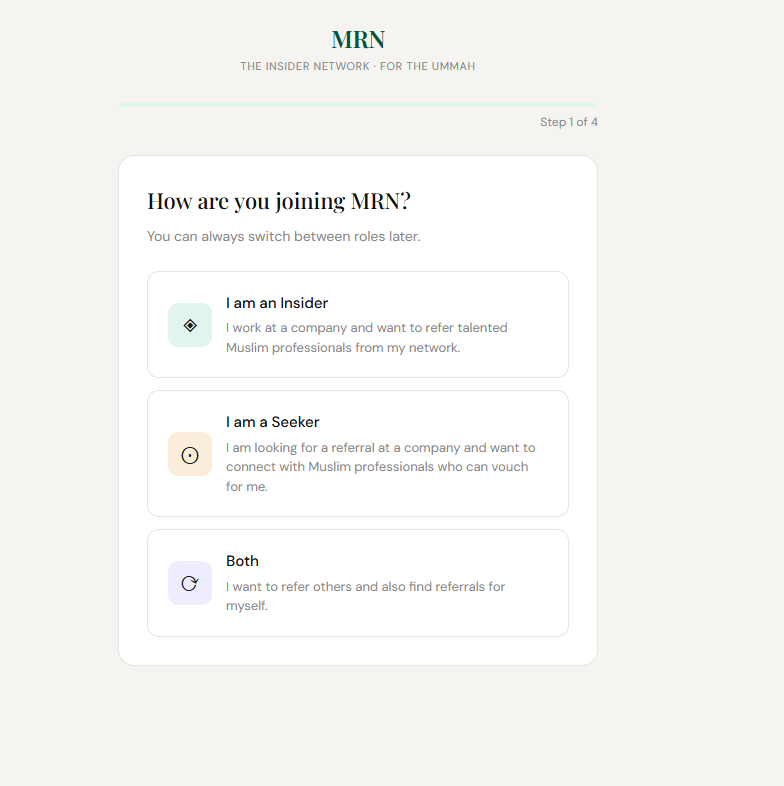
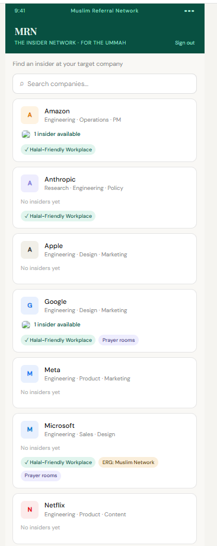
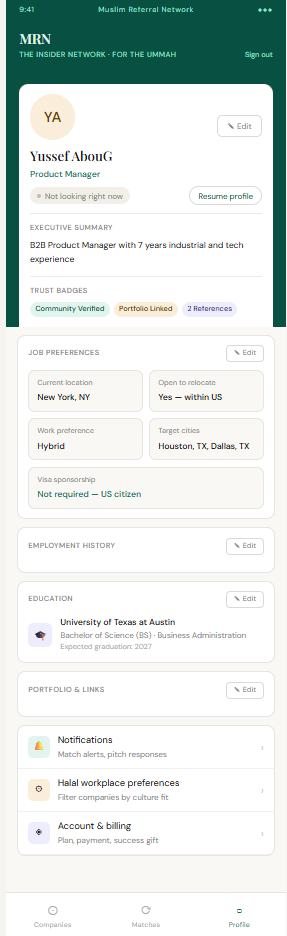
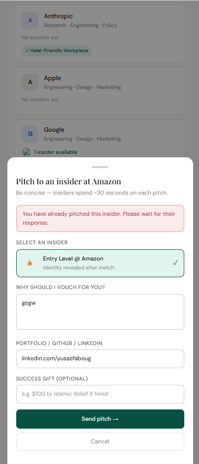
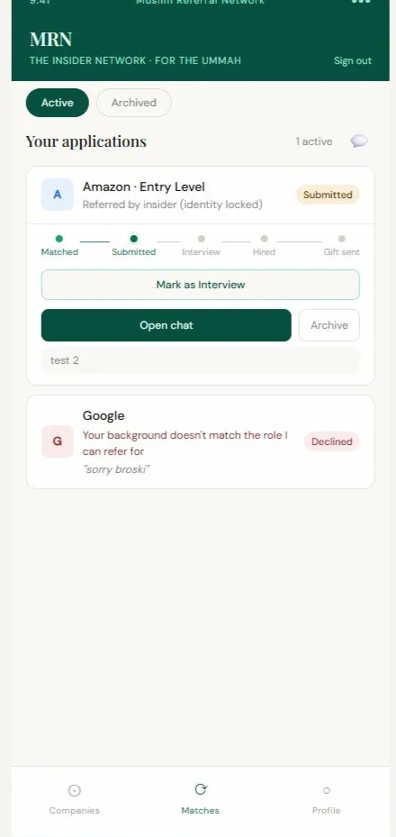
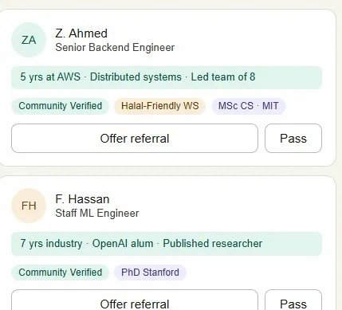
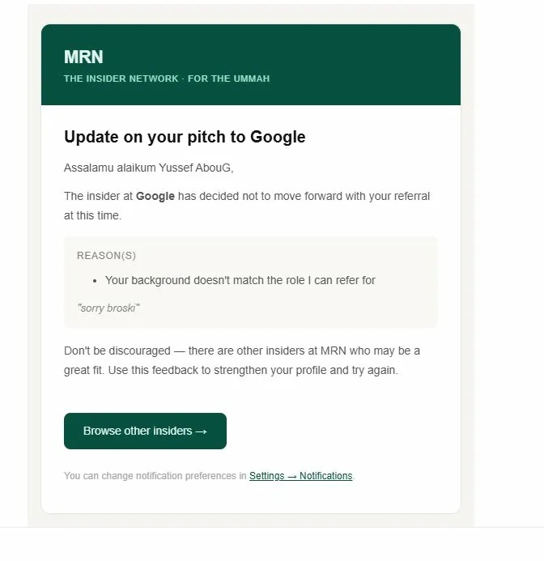
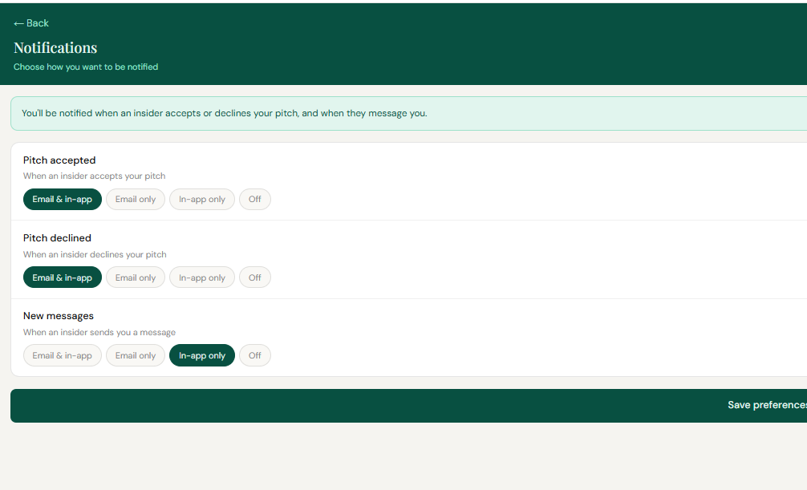

# MRN: Muslim Referral Network

**A trust-based referral marketplace for Muslim professionals.**

Insiders at target companies refer seekers through private, accountable matches, replacing cold applications with warm introductions from people who share the same values and community.

---

**Built by Yussef Abou-Ghanem**

📫 yussef.aboug@gmail.com
🔗 [LinkedIn](https://www.linkedin.com/in/yussef-abou/)

---

## The Problem

Muslim professionals, especially early-career candidates, immigrants, and visa-dependent job seekers, are disproportionately reliant on cold applications. They lack the informal referral networks that move resumes to the top of the pile at top companies. Meanwhile, many Muslim insiders at those same companies want to help but have no structured, low-friction way to do it. LinkedIn is too noisy, cold DMs are unaccountable, and community group chats don't scale.

MRN is a purpose-built marketplace that connects the two sides with accountability, pacing, and trust built in from day one.

## The Users

**Seekers** are Muslim job seekers (students, recent grads, career switchers, experienced ICs) looking for referrals at specific target companies. They need a way to reach insiders without cold-pitching strangers on LinkedIn and without burning social capital.

**Insiders** are Muslim professionals currently employed at those target companies who want to refer qualified candidates but need control over their pipeline, their time, and their professional reputation inside their company.

The platform's defining constraint: **insiders are the scarce resource.** Every product decision is filtered through the question "does this protect insider time and trust, or does it burn it?" Get that wrong and insiders churn, which collapses the entire marketplace.

## Core Flow

1. Seeker browses a directory of companies and the insiders who work at them.
2. Seeker sends a structured pitch to a specific insider (not a mass broadcast).
3. Insider reviews the pitch and either accepts or declines with a reason.
4. On accept, a private chat opens and a match enters the pipeline.
5. Pipeline stages track the referral through submitted, interviewing, and hired.
6. Insiders earn Barakah Points and badges for successful referrals, building long-term reputation.

## Screenshots

  
  &nbsp;&nbsp;&nbsp;
  
  &nbsp;&nbsp;&nbsp;
  

  <em>Left: Onboarding role selection (Insider, Seeker, or Both). Center: Company directory showing live insider counts, halal-friendly tags, and indicators. Right: Full seeker profile with trust badges, job preferences, and education history.</em>

 

  
  &nbsp;&nbsp;&nbsp;
  
  &nbsp;&nbsp;&nbsp;
  

  <em>Left: Pitch form with duplicate detection ("You have already pitched this insider"). Center: Seeker matches page showing the pipeline tracker (Matched → Submitted → Interview → Hired → Gift sent) and a declined pitch with reasons. Right: Insider talent feed with dynamic badges (experience, education, trust, halal-friendly).</em>

 

  
  &nbsp;&nbsp;&nbsp;
  

  <em>Left: Branded email notification on pitch decline, showing the reason and an encouraging CTA. Right: Per-event notification preferences (email, in-app, both, or off).</em>

## What's Shipped (v1)

- Authentication with email confirmation, password reset, and banned account handling
- Multi-step onboarding with role selection and profile build-out
- Seeker and insider profiles with dynamic badges, employment and education history, and portfolio links
- Company directory with live insider counts and avatars
- Talent feed with 5 filter types (visa sponsorship, work preference, relocation, location, education status)
- Structured pitch flow with duplicate detection, company cooldown, and badge-based rate limiting
- Accept and decline flow with multi-select decline reasons and in-app plus email notification to the seeker
- Real-time private chat with read receipts, optimistic UI, and insider-controlled initiation and closure
- Pipeline stage tracking split by role (seekers mark interviewing and hired, insiders mark submitted)
- Automated reminder cadence at 48 hours, 7 days, 14 days, and 18 days for stale matches
- Match archiving with active and archived tabs, manual archive, auto-archive on completion
- Notification preferences (in-app, email, both, or off) per event type
- Terms of Service and Privacy Policy (NJ governing law, GDPR and CCPA compliant)
- Full account deletion with downstream data purge
- Name change logging with auto-flagging after repeated changes (abuse prevention)

## Product Roadmap

**v2 (in progress)**
- Admin dashboard for user management, flagged account review, and badge administration
- Landing page and marketing site with SEO
- Performance work: cursor-based pagination on talent feed, companies, and chat history
- Stripe integration to enforce success gift commitments from seekers to insiders
- Employment overlap detection in the experience badge calculation for accuracy

**v3 (planned)**
- Native mobile apps via React Native and Expo, including push notifications
- App Store and Google Play submission

## Product Decisions and Tradeoffs

The sections below walk through five of the most consequential product decisions I made while building MRN. Each one follows a problem, options, decision, and tradeoff format.

### 1. Badge-based tiered rate limiting on pitches

**Problem:** Without a pitch cap, a single seeker can spam every insider in their target company within minutes, burning insider goodwill and collapsing trust in the platform. With too strict a cap, high-intent seekers are throttled and the marketplace feels dead.

**Options considered:**
- **A)** Flat weekly cap for all seekers (simple, but punishes serious users)
- **B)** Time-based cooldown between pitches (fair but slow, and doesn't reward profile quality)
- **C)** Badge-tiered cap that rewards profile completeness and community verification

**Decision:** Badge-tiered rolling 7-day window. No badges gets 3 pitches per week. Community Verified (LinkedIn confirmed) raises it to 4. Portfolio Linked raises it to 6.

**Why:** Tying rate limits to badges turns the cap into a progression system, not a punishment. A seeker who hits their limit immediately knows what to do to raise it (add a LinkedIn URL, add a portfolio), which improves profile quality across the whole platform. It also creates a natural signal for insiders: a seeker with higher allowance has demonstrably invested more in their profile, so their pitch is more likely to be taken seriously.

**Tradeoff:** This adds complexity. A seeker hitting their limit has to understand *why* and has to see the exact reset date or the experience feels broken. I built explicit error messaging with the reset date and the path to unlock higher tiers. It also means the caps are enforced client-side against a Supabase badge check, which is acceptable for v1 but would need server-side enforcement before scale.

### 2. Insider-controlled chat initiation and closure

**Problem:** In two-sided marketplaces, whoever controls the conversation controls the power dynamic. If either side can open or end chats freely, insiders get flooded and seekers feel ghosted when chats go dark. If the platform controls it, nobody feels ownership and abandonment climbs.

**Options considered:**
- **A)** Mutual chat: either side can start and end
- **B)** Seeker-initiated: seeker opens chat after accept, insider can leave
- **C)** Insider-controlled: insider decides when to open and when to end

**Decision:** Insider-controlled. The insider initiates the chat when they're ready to talk, and the insider explicitly ends it when the referral is complete or no longer viable.

**Why:** The scarcest resource on MRN is insider time and attention. Giving insiders explicit control over their pipeline signals to them that the platform respects that scarcity, which is the single biggest driver of insider retention. It also creates a clean accountability model: chats don't drift forever because there's an explicit end state owned by the person with the most context (the insider). For seekers, the tradeoff is loss of agency, but that's offset by the fact that they already chose which insider to pitch, and a match they can't drag out indefinitely forces them to actually execute on the referral.

**Tradeoff:** Seekers lose some control, and a negligent insider can leave a match hanging. I mitigated the second risk with the 48-hour, 7-day, 14-day, and 18-day reminder cadence (see decision 3) and a stale-match flag that notifies the seeker after 18 days so they can move on without needing to confront the insider directly.

### 3. Escalating reminder cadence with an 18-day stale threshold

**Problem:** Referrals take real time. Some insiders genuinely need two or three weeks to find the right moment to submit. But a match that sits silent forever is worse than a decline, because the seeker is holding out hope instead of pitching someone else. The platform has to balance patience with momentum.

**Options considered:**
- **A)** Single reminder after 7 days, auto-expire at 14 days (too aggressive, kills legitimate in-progress referrals)
- **B)** No reminders, let users self-manage (too passive, matches go dark)
- **C)** Escalating cadence that nudges gently first and escalates only if ignored

**Decision:** In-app reminder at 48 hours (low-cost nudge), in-app plus email at 7 days, in-app plus email at 14 days, and at 18 days the match is flagged as stale, the seeker is notified, and the insider gets a final email.

**Why:** The cadence reflects notification fatigue research: a single gentle nudge early lets the insider self-correct without feeling harassed. Escalation to email at 7 days catches insiders who've stopped opening the app. The 14-day push is the last chance before the relationship is formally marked as broken. At 18 days, the seeker is freed to explore other options without social awkwardness, and the insider's inaction is now on the record for internal reputation signals. 18 days specifically (not 14 or 21) was chosen to give one full business cycle plus a buffer for insiders who travel or take PTO.

**Tradeoff:** Reminder logic runs on pg_cron and makes HTTP calls to the app to trigger emails, which adds operational complexity and a dependency on the cron job staying healthy. I accepted this because the alternative (client-side reminders) can't run when the user isn't in the app, which is exactly when reminders are needed most.

### 4. Pipeline stages split by role (source-of-truth ownership)

**Problem:** In a pipeline tracking system, someone has to update the stage as the referral progresses. If either side can update any stage, one side can game the metrics (a seeker marks themselves hired to inflate a fake success rate, or an insider marks submitted when they haven't actually done it). If only one side updates everything, they're stuck doing admin work they don't have visibility into.

**Options considered:**
- **A)** Either side can update any stage (fast but gameable)
- **B)** Platform auto-detects stages from signals like chat activity (impossible to do reliably)
- **C)** Split ownership by who has ground truth for each stage

**Decision:** Insiders mark "submitted" because only they know when the internal referral form is actually filed. Seekers mark "interviewing" and "hired" because only they know whether a recruiter reached out and whether they got an offer.

**Why:** This is a source-of-truth problem. Whoever has direct, verifiable knowledge of a state change owns that update. Any other design requires one side to take the other side's word for it, which corrupts the data that trust features (Barakah Points, Top Referrer badge, platform stats) depend on. It also distributes the data entry load evenly rather than piling it on one side.

**Tradeoff:** Stages can sit stale if the responsible party doesn't update. A seeker who ghosts after getting hired means the insider never gets credit. I'm accepting this for v1 and plan to address it in v2 with a gentle prompt to the other side when too much time passes at a given stage (for example, 10 days after submitted with no interviewing update, prompt the seeker).

### 5. Company cooldown (2 pitches per company per 30 days)

**Problem:** Even with per-user rate limits, a determined seeker could pitch every single insider at one company in rapid succession. This is low-value for the seeker (diminishing returns) and actively harmful to the platform (insider Slack channels notice, and MRN gets a reputation inside target companies as a spam source).

**Options considered:**
- **A)** No company cooldown, rely only on per-user rate limit (fails on focused spam)
- **B)** Hard cap of 1 pitch per company ever (too strict, blocks legitimate retry after a decline)
- **C)** Rolling 30-day window with a reasonable cap

**Decision:** 2 pitches per company per rolling 30 days. After the second pitch at a company, the seeker is blocked at that company with the cooldown end date shown, but can still pitch at other companies freely.

**Why:** Two pitches gives a seeker a reasonable shot at finding the right insider match within a company (different departments, different levels) without turning into a spray attack. The 30-day window is long enough to prevent abuse but short enough that a legitimate candidate who got declined can come back with a stronger profile. Showing the exact cooldown end date is critical. An unexplained block feels like a bug, but an explicit end date feels like a rule.

**Tradeoff:** Edge case of a seeker targeting a very large company (Amazon, Google) where 2 pitches may not find the right team. Accepted for v1 because the alternative (scaling the cap by company size) adds logic complexity that isn't justified until I see the edge case actually happen in user data.

## Success Metrics

**North Star:** Successful referrals that lead to hires.

This is the metric that matters because it's the only one where all three stakeholders win at once: the seeker gets a job, the insider gets Barakah Points and reputation, and the platform gets a success story that compounds into trust and growth.

**Supporting metrics:**

- **Pitch acceptance rate** (accepted / total pitches). Tracks whether seekers are sending quality, well-matched pitches and whether rate limits and cooldowns are working. Target: above 35%.
- **Time to first match** (seeker signup to first accepted pitch). Proxy for marketplace liquidity. If this climbs, it means the insider side isn't dense enough in the seeker's target companies. Target: under 7 days.
- **Match to chat conversion** (accepted pitches that produce a real chat conversation, defined as 5+ messages). Measures whether matches actually turn into meaningful connections or just go silent. Target: above 70%.
- **Insider weekly active rate** (insiders who review at least one pitch per week / total insiders). The health of the scarce side of the marketplace. If this drops, everything else collapses. Target: above 60%.
- **Pipeline completion rate** (matches that reach submitted, interviewing, or hired / total matches). Catches the "ghost match" problem before it becomes systemic.
- **Decline reason distribution.** Not a single metric but a qualitative signal. If the same decline reason spikes (for example, "profile needs more detail"), that's a product fix, not a user problem.

**Guardrail metrics:**

- **Insider churn rate.** The platform dies if insiders leave faster than they join. Watched weekly.
- **Reports and flagged accounts.** Abuse signal. If this rises, trust is eroding.
- **Average pitches per seeker per week.** If this creeps up over time it means rate limits are being circumvented or edge-cased.

## Technical Architecture (Brief)

Built as a mobile-first web app using Next.js 16 for the frontend and routing, Supabase for the database (PostgreSQL with row-level security, auth, real-time subscriptions, and pg_cron for scheduled jobs), and Resend for transactional email. The data model is organized around users, profiles (seeker and insider), pitches, matches, messages, and notifications, with RLS policies ensuring users can only read and write their own data plus data from users they have an active relationship with.

Notable technical choices:
- **RPC functions** for complex queries like `get_matches_with_meta` to avoid N+1 query patterns as the platform scales
- **pg_cron** for scheduled background jobs (reminder cadence, match history cleanup)
- **Optimistic UI** in the chat layer with rollback on failure for responsive feel
- **SECURITY DEFINER** with explicit search paths on RPCs for safe cross-table operations

## Status

**Currently:** Phase 5 (guardrails and polish) in progress. Core match flow, chat, pipeline, notifications, rate limiting, legal pages, and archiving are shipped and working. Admin dashboard, pagination, landing page, and Stripe integration are the remaining items before public launch.

## A Note on How This Was Built

MRN was built in close collaboration with Claude, Anthropic's LLM, used as a pair-programming and product-thinking partner throughout. I directed the product vision, made every product and design decision documented in this README, defined the data model and user flows, and tested every feature. Claude accelerated implementation, helped me stress-test edge cases, and acted as a sounding board on architectural choices.

I believe AI-assisted development is a force multiplier for product managers who want to build real working software to validate their ideas. Being transparent about how I built MRN matters more to me than claiming solo authorship. The judgment calls, tradeoffs, and product decisions are mine. The velocity is ours.

---

## Contact

If you're hiring product managers and this kind of thinking is interesting to you, I'd love to talk.

**Yussef Abou-Ghanem**
📫 yussef.aboug@gmail.com
🔗 [LinkedIn](https://www.linkedin.com/in/yussef-abou/)
